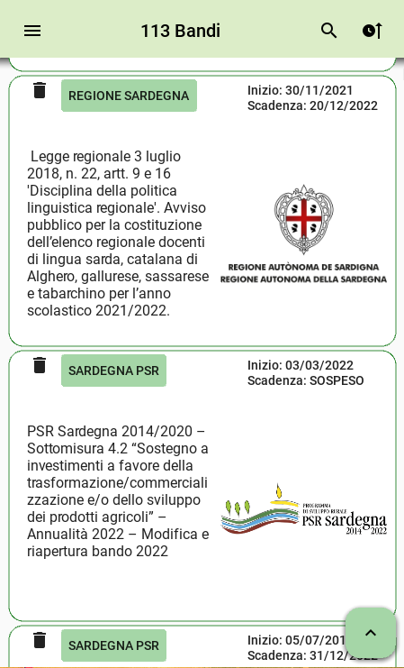
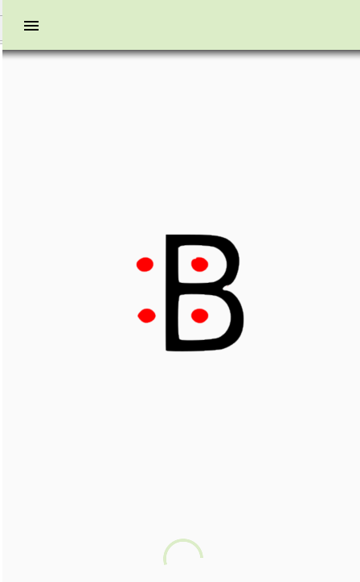
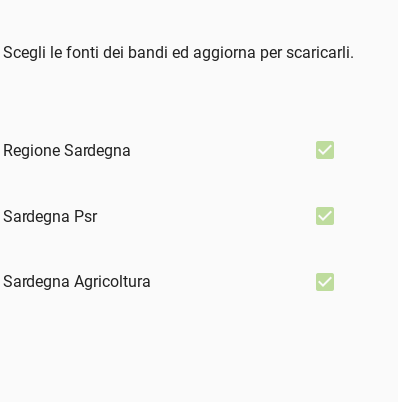

# BandiSardegna


Un App multipiattaforma sviluppata con Python, Kivy e KivyMD per tenere sotto controllo i bandi rivolti ai cittadini della Regione Sardegna.


## Installazione su Linux o Windows

```
$ pip install -r requirements.txt

$ git clone https://github.com/teonactl/BandiSardegna.git

$ cd BandiSardegna

$ python main.py
```

## Installazione su Android

Entra nella cartella bin/ e scarica l'ultima versione dell'APK, ricordati di dare al tuo browser il permesso di installare nuove applicazioni.


## Contribuisci

Se vuoi utilizzare una fonte non presente nell'applicazione, puoi mandare una mail con oggetto FONTE_BANDI contenente l'indirizzo che vorresti fosse aggiunto come fonte alla mail : teonactl@hotmail.it


## Screenshots

  


